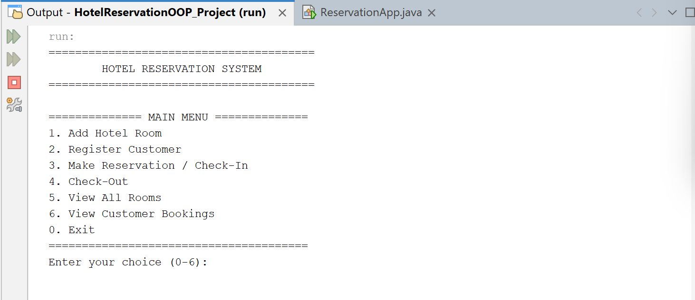
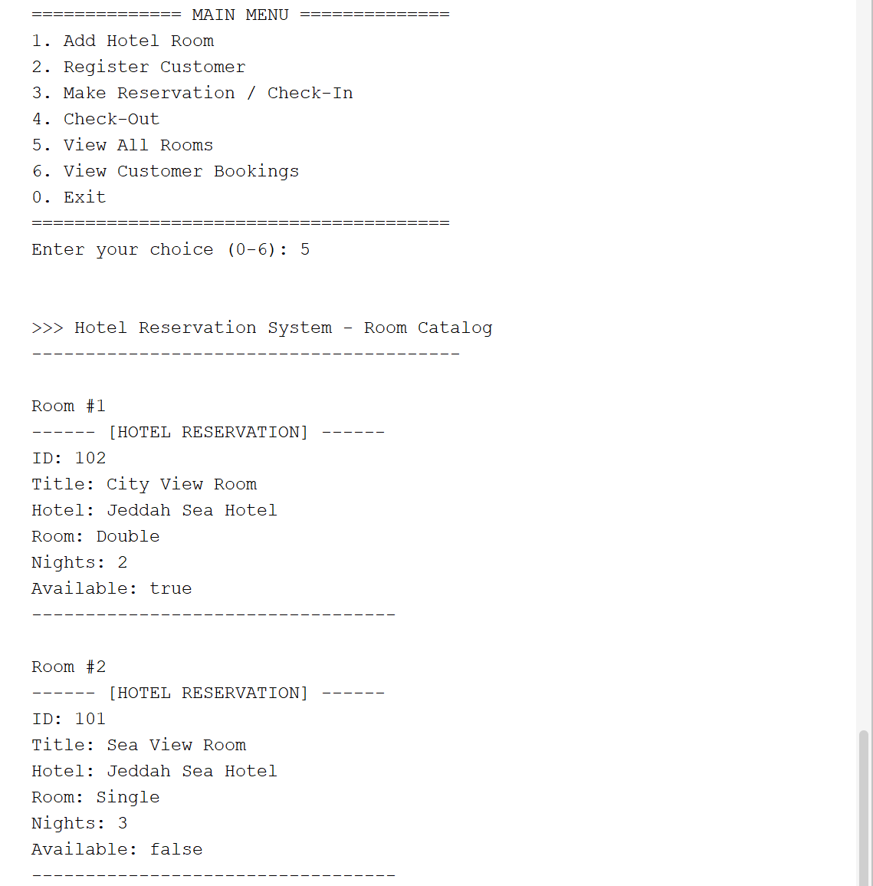
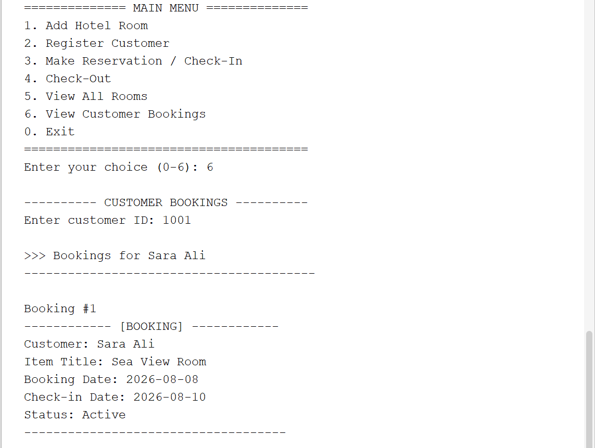
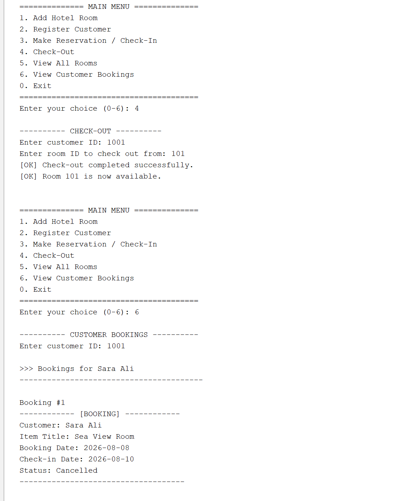

# Hotel Reservation System

A Java-based console application for managing hotel rooms, customers, reservations, check-ins, and check-outs.

## Overview

The Hotel Reservation System is an academic Java project developed to demonstrate core Object-Oriented Programming concepts.

The system allows users to add hotel rooms, register customers, create reservations, check customers in and out, display room information, and view customer bookings through an interactive console menu.

## Features

- Add hotel rooms to the system
- Register new customers
- Make room reservations
- Check customers in
- Check customers out
- View all hotel rooms
- View customer bookings
- Search for rooms by ID
- Search for customers by ID
- Display room availability
- Sort rooms alphabetically
- Handle invalid room IDs using a custom exception
- Handle invalid user input without stopping the program

## Object-Oriented Programming Concepts

This project demonstrates several Java Object-Oriented Programming concepts, including:

- Classes and Objects
- Inheritance
- Abstract Classes
- Interfaces
- Encapsulation
- Polymorphism
- Method Overriding
- Comparable
- ArrayList
- TreeSet
- Exception Handling
- Custom Exceptions
- Object Equality using `equals()`
- Object Cloning using `clone()`

## Technologies

- Java
- NetBeans IDE

## Project Structure

```text
Hotel-Reservation-System/
│
├── src/
│   └── oop_project/
│       ├── Booking.java
│       ├── Customer.java
│       ├── HotelReservation.java
│       ├── Reservable.java
│       ├── ReservationApp.java
│       ├── ReservationItem.java
│       ├── ReservationNotFoundException.java
│       └── ReservationSystem.java
│
├── screenshots/
│   ├── main-menu.png
│   ├── room-catalog.png
│   ├── active-booking.png
│   └── checkout.png
│
├── README.md
└── .gitignore
```

## How the System Works

When the program starts, the user is shown an interactive menu:

```text
============== MAIN MENU ==============
1. Add Hotel Room
2. Register Customer
3. Make Reservation / Check-In
4. Check-Out
5. View All Rooms
6. View Customer Bookings
0. Exit
=======================================
```

The user selects an option by entering its number and then follows the instructions displayed in the console.

When adding a hotel room, the system asks for:

- Room ID
- Room title
- Hotel name
- Room type
- Number of nights

When making a reservation, the system asks for:

- Customer ID
- Room ID
- Booking date
- Check-in date

## Screenshots

### Main Menu



### Room Catalog



### Active Booking



### Check-Out



## How to Run

1. Download or clone the repository.
2. Open the project in NetBeans or another Java IDE.
3. Open `ReservationApp.java`.
4. Run the program.
5. Follow the instructions shown in the console.

## Example Input

Example room information:

```text
Room ID: 101
Room Title: Sea View Room
Hotel Name: Jeddah Sea Hotel
Room Type: Single
Number of Nights: 3
```

Example customer information:

```text
Customer ID: 1001
Name: Sara Ali
Email: sara@example.com
```

Example reservation information:

```text
Customer ID: 1001
Room ID: 101
Booking Date: 2026-08-08
Check-In Date: 2026-08-10
```

## Academic Context

This project was developed as an academic Object-Oriented Programming project.

It demonstrates the use of Java OOP principles, collections, exception handling, inheritance, interfaces, object comparison, and interactive console input in a hotel reservation system.
